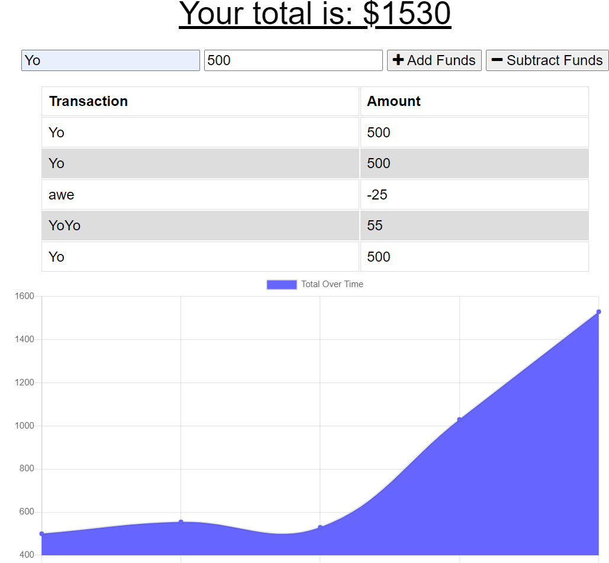

# <Homework Week 19: Online/Offline Budget Tracker>  
  
    

  ## Description  
  ### What was your motivation?  
    - Using existing code, add online/offline functionality using IndexedDB to cache transactions when offline, and automatically deplay them when back online.  
  ### Why did you build this project?  
    -  Add/Remove expenses to your budget with or without a connection.
  ### What problem does it solve?  
    -  AS AN avid traveler I WANT to be able to track my withdrawals and deposits with or without a data/internet connection SO THAT my account balance is accurate when I am traveling. 
  ### What did you learn making this project?  
    - Functionality of service workers, manifests, indexedDB, and mongoDB Atlas  
   
  ## Table of Contents 
  - [Installation](#installation)  
  - [Usage](#usage)  
  - [Credits](#credits)  
  - [License](#license)  

  ## Installation  
  ### The application will be invoked by using the following command:  
      Run in Web Browser  

  ## Usage  
    
      
  ## Credits  
  Contact me at: [email](poo328@my.utsa.edu "email")  
  Github can be found at: [Github](https://github.com/MrG105 "Github")  
    
  ## License
      Licensed under the MIT license  
  ---